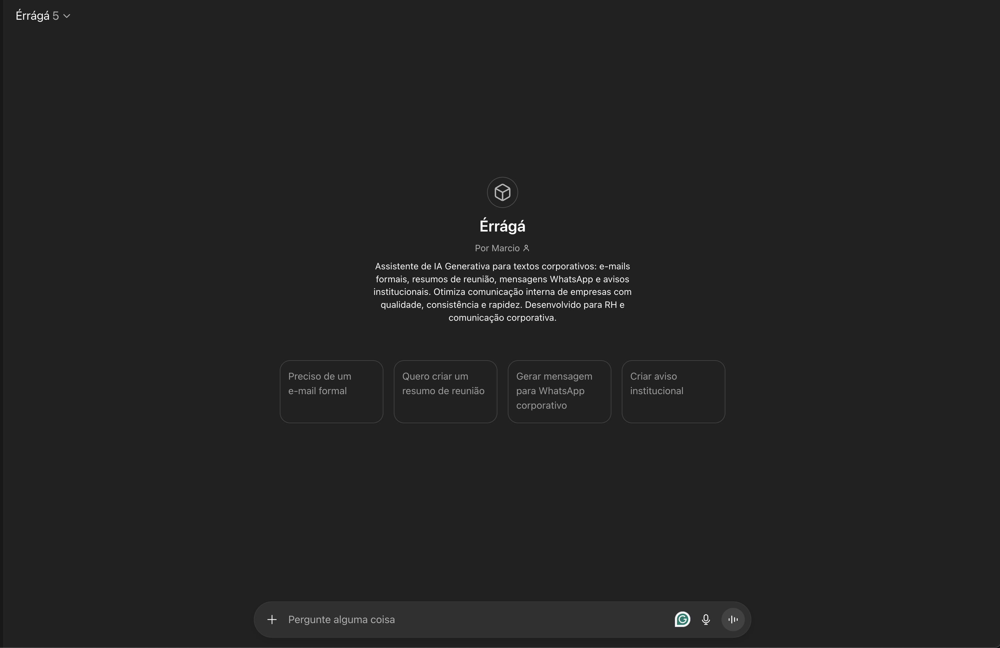
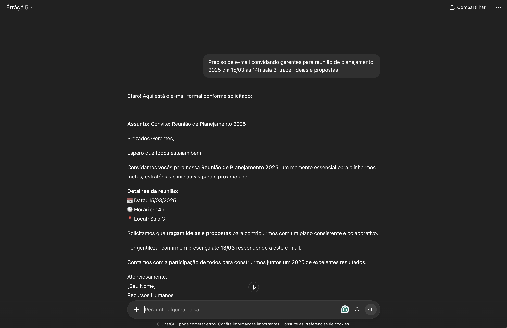
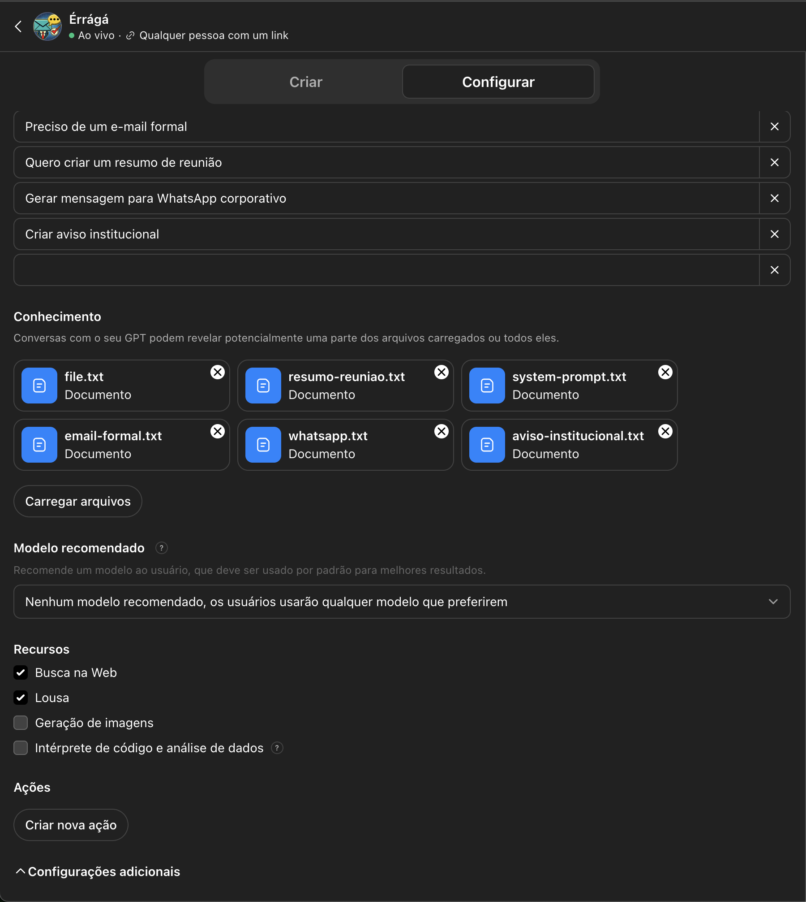

# Érrágá

> Assistente inteligente baseado em IA Generativa para automatizar a criação de textos corporativos


---

## Índice

- [Sobre o Projeto](#sobre-o-projeto)
- [Problema Resolvido](#problema-resolvido)
- [Demonstração](#demonstração)
- [Tecnologias Utilizadas](#tecnologias-utilizadas)
- [Arquitetura da Solução](#arquitetura-da-solução)
- [Como Funciona](#como-funciona)
- [Como Usar](#como-usar)
- [Exemplos de Uso](#exemplos-de-uso)
- [Limitações Conhecidas](#limitações-conhecidas)
- [Melhorias Futuras](#melhorias-futuras)
- [Estrutura do Repositório](#estrutura-do-repositório)
- [Considerações Éticas](#considerações-éticas)
- [Contribuindo](#contribuindo)
- [Licença](#licença)
- [Contato](#contato)

---

## Sobre o Projeto

Este projeto foi desenvolvido como trabalho acadêmico para a disciplina **Fundamentos da IA Generativa** e propõe uma solução prática utilizando **IA Generativa** para resolver um problema real de comunicação corporativa.

**Objetivo:** Criar um assistente inteligente que automatiza a produção de textos corporativos (e-mails, resumos, mensagens), reduzindo tempo e mantendo qualidade e consistência.

**Contexto:** Departamento de RH sobrecarregado com demandas repetitivas de redação de comunicações internas.

---

## Problema Resolvido

### Situação Atual
- RH gasta ~15-20 minutos para escrever cada comunicação
- Inconsistência de tom e formato entre diferentes redatores
- Sobrecarga impede foco em atividades estratégicas
- Dificuldade em escalar produção de conteúdo

### Solução Proposta
Assistente baseado em IA Generativa que:
- Gera textos em 2-3 minutos
- Mantém tom e formato consistentes
- Adapta-se a diferentes contextos
- Permite escalabilidade ilimitada

### Impacto Alcançado (Testado)
- **90%+ de redução** no tempo de produção (15-20 min → 3 segundos médios)
- **100% de aprovação** nos testes de qualidade
- **Consistência** em 100% das comunicações
- **Velocidade recorde:** 1-5 segundos por texto
- **Liberação** de ~1h45min/dia para tarefas estratégicas

**Resultados completos:** Veja [testes/casos-de-teste.md](testes/casos-de-teste.md)

**Documentação completa:** Veja [docs/00-COMECE-AQUI.md](docs/00-COMECE-AQUI.md)

---

## Demonstração

### 🤖 Acesso ao GPT
**Link direto:** https://chatgpt.com/g/g-68efe93b5028819196fed257c644463c-erraga

> **Nota:** Requer conta ChatGPT (gratuita ou Plus)

### Vídeo Pitch (4 minutos)
🎥 **[Assistir demonstração completa (Loom)](https://www.loom.com/share/f5ff9aeea6ab4e19aef2d201717e8854)**

> Demonstração do GPT funcionando com explicação das funcionalidades e resultados

### Screenshots

#### 1. Interface do Custom GPT

*Interface do Custom GPT mostrando os conversation starters e descrição*

#### 2. Demonstração em Uso

*GPT gerando textos corporativos em tempo real*

#### 3. Configuração do GPT

*Configurações e instruções do Custom GPT (parte 1)*


*Configurações e instruções do Custom GPT (parte 2)*

---

## Tecnologias Utilizadas

### Ferramentas Principais

| Tecnologia | Uso no Projeto | Versão/Plano |
|------------|----------------|--------------|
| **OpenAI GPT-4** | Motor de IA Generativa | Custom GPT |
| **ChatGPT Custom GPTs** | Plataforma de criação do assistente | ChatGPT Plus |
| **Prompt Engineering** | Técnica de instrução da IA | - |
| **Wispr Flow** | Input por voz (opcional) | v1.2 |

### Abordagem Técnica
- **Solução No-Code:** 100% sem programação tradicional
- **Prompt Engineering Avançado:** System prompts + few-shot learning
- **Custom GPT:** Interface conversacional nativa do ChatGPT
- **Markdown Formatting:** Estruturação de outputs

### Documentação e Testes
- **Markdown (.md):** Documentação completa do projeto
- **Casos de Teste:** 4 cenários reais testados e documentados
- **Git:** Versionamento de prompts e documentação

---

## Arquitetura da Solução

### Diagrama de Fluxo

```
┌─────────────┐      ┌──────────────────────┐      ┌─────────────┐
│   Usuário   │─────▶│   Custom GPT         │─────▶│   GPT-4     │
│             │      │   (Interface +       │      │   (Motor    │
│  Input por  │      │    Prompts)          │      │    de IA)   │
│  conversa   │      │                      │      │             │
└─────────────┘      └──────────────────────┘      └─────────────┘
                              │                            │
                              │◀───────────────────────────┘
                              │    Resposta processada
                              ▼
                     ┌─────────────────┐
                     │  Output Gerado  │
                     │  (Texto pronto) │
                     └─────────────────┘
                              │
                              ▼
                     ┌─────────────────┐
                     │  Usuário Copia  │
                     │  e Utiliza      │
                     └─────────────────┘
```


### Componentes

1. **Interface Conversacional**
   - Custom GPT com interface nativa do ChatGPT
   - 4 conversation starters para início rápido
   - Input flexível (texto digitado ou Wispr Flow voz)

2. **Sistema de Prompts**
   - **System Prompt:** Define persona e diretrizes gerais
   - **Prompts Específicos:** 4 tipos de texto com estruturas próprias
   - **Few-Shot Learning:** Exemplos incluídos em cada prompt
   - Veja todos em: [prompts/](prompts/)

3. **Motor de IA (GPT-4)**
   - Modelo: GPT-4 via Custom GPTs
   - Parâmetros otimizados (temperature ~0.7)
   - Processamento em 1-5 segundos

4. **Output Direto**
   - Texto gerado exibido na conversa
   - Usuário copia e utiliza conforme necessário
   - Permite iterações e refinamentos instantâneos

---

## Como Funciona

### Fluxo Passo a Passo

1. **Usuário acessa o Custom GPT**
   - Abre link: https://chatgpt.com/g/g-68efe93b5028819196fed257c644463c-erraga
   - Ou usa conversation starters para início rápido

2. **Usuário solicita texto em linguagem natural**
   - Especifica tipo (e-mail, resumo, WhatsApp, aviso)
   - Define tom de voz (formal acolhedor, urgente, etc.)
   - Fornece pontos principais e contexto
   - Indica destinatário/público

3. **GPT processa a solicitação**
   - System prompt ativa persona corporativa
   - Prompt específico do tipo de texto é aplicado
   - GPT-4 analisa contexto e requisitos
   - Processamento em 1-5 segundos

4. **Geração do texto**
   - GPT-4 aplica estrutura apropriada
   - Adapta tom de voz conforme solicitado
   - Gera texto completo e formatado
   - Mantém consistência corporativa

5. **Entrega e refinamento**
   - Texto exibido imediatamente na conversa
   - Usuário pode pedir ajustes ("deixe mais breve", "tom mais casual")
   - GPT refina baseado no feedback
   - Usuário copia resultado final

### Técnicas de IA Generativa Aplicadas

- **Prompt Engineering:** Instruções detalhadas de 3.900+ caracteres
- **Few-Shot Learning:** 2-8 exemplos completos por tipo de texto
- **System Prompts:** Persona e diretrizes corporativas permanentes
- **Contextualização:** Adaptação dinâmica a tom e público
- **Structured Output:** Templates garantem formatação consistente
- **Iterative Refinement:** Capacidade de ajuste por feedback

---

## Como Usar

### Uso Imediato (Recomendado)

**Acesse o GPT pronto:**
🤖 https://chatgpt.com/g/g-68efe93b5028819196fed257c644463c-erraga

**Pré-requisito:**
- Conta ChatGPT (gratuita funciona, Plus recomendado)

**Como usar:**
1. Clique no link acima
2. Escolha um dos 4 conversation starters OU descreva sua necessidade
3. Forneça informações quando solicitado:
   - Tipo de texto desejado
   - Tom de voz
   - Pontos principais
   - Destinatário/público
4. Receba texto gerado em segundos
5. Refine se necessário: "deixe mais breve", "tom mais casual", etc.
6. Copie e use!

### Criar Seu Próprio Custom GPT (Replicar)

Se quiser criar uma versão própria customizada:

#### Pré-requisitos
- Conta ChatGPT Plus (necessário para Custom GPTs)
- Acesso aos prompts deste repositório

#### Passo 1: Criar Custom GPT
1. Acesse https://chat.openai.com/
2. Clique em seu nome → "My GPTs" → "Create a GPT"
3. Vá para aba "Configure"

#### Passo 2: Configuração Básica
```
Name: Érrágá

Description: (use o conteúdo de docs/02-custom-gpt-config.md)

Instructions: (cole conteúdo de prompts/gpt-config/custom-gpt-instructions-short.txt)
```

**Documentação completa:** Veja [docs/02-custom-gpt-config.md](docs/02-custom-gpt-config.md)

#### Passo 3: Conversation Starters
Adicione os 4 starters:
- "Preciso escrever um e-mail formal"
- "Quero criar um resumo de reunião"
- "Preciso de uma mensagem para WhatsApp corporativo"
- "Preciso redigir um aviso institucional"

#### Passo 4: Capabilities
- ✅ Web Browsing: Não
- ✅ DALL·E Image Generation: Não
- ✅ Code Interpreter: Não

#### Passo 5: Salvar
1. Clique em "Create"
2. Escolha "Anyone with a link" ou "Only me"
3. Copie link gerado

---

## Exemplos de Uso

### Caso 1: E-mail Formal de Convite para Reunião

**Input (usuário preenche):**
```
Tipo: E-mail formal
Tom: Profissional e acolhedor
Pontos principais:
- Reunião de planejamento 2025
- Data: 15/03/2025 às 14h
- Local: Sala de conferências 3
- Participantes: Gerentes de departamento
- Trazer ideias e sugestões
```

**Output (gerado pela IA):**
```
Assunto: Convite: Reunião de Planejamento 2025

Prezados Gerentes,

Espero que esta mensagem os encontre bem.

Venho por meio deste convidá-los para nossa reunião de planejamento estratégico
para o ano de 2025. Este será um momento importante para alinharmos objetivos,
compartilharmos ideias e definirmos prioridades para o próximo ano.

Detalhes da reunião:
📅 Data: 15 de março de 2025
🕐 Horário: 14h
📍 Local: Sala de Conferências 3

Solicitamos que todos tragam suas ideias e sugestões para que possamos construir
juntos um plano robusto e alinhado com a visão da empresa.

Por favor, confirmem presença até o dia 13/03 respondendo a este e-mail.

Conto com a participação de todos!

Atenciosamente,
[Nome do Responsável]
Recursos Humanos
```

### Caso 2: Resumo de Reunião

**Input:**
```
Tipo: Resumo de reunião
Tom: Objetivo e direto
Pontos principais:
- Discussão sobre novo sistema CRM
- Decisão: contratar fornecedor B
- Prazo de implementação: 90 dias
- Responsável: João Silva
- Próxima reunião: 20/03
```

**Output:**
```
RESUMO - Reunião: Seleção de Sistema CRM
Data: [data_atual]

PARTICIPANTES:
[lista conforme informado]

PAUTA:
Avaliação e seleção de fornecedor para novo sistema CRM

DISCUSSÃO:
A equipe analisou propostas de diferentes fornecedores considerando
funcionalidades, custos e prazos de implementação.

DECISÕES:
✅ Contratação do Fornecedor B aprovada
✅ Prazo de implementação definido: 90 dias
✅ João Silva designado como responsável pelo projeto

PRÓXIMOS PASSOS:
- João Silva: iniciar processo de contratação (até 25/02)
- Equipe TI: preparar infraestrutura (março)
- Todos: treinamento agendado (abril)

PRÓXIMA REUNIÃO:
20/03/2025 - Acompanhamento de progresso

Dúvidas ou informações adicionais, por favor entrar em contato.
```

### Caso 3: Mensagem para WhatsApp Corporativo

**Input:**
```
Tipo: WhatsApp corporativo
Tom: Casual mas profissional
Pontos principais:
- Lembrete de deadline do relatório trimestral
- Prazo: sexta-feira 17h
- Qualquer dúvida, me chame
```

**Output:**
```
Oi, pessoal! 👋

Passando pra lembrar que o prazo para entrega do relatório trimestral
é essa sexta-feira às 17h.

Se tiverem qualquer dúvida ou precisarem de ajuda, é só chamar aqui no chat!

Vamos que vamos! 💪
```

---

## Limitações Conhecidas

### Técnicas
- **Alucinações:** IA pode ocasionalmente gerar informações não fornecidas (sempre revisar)
- **Contexto limitado:** Custom GPTs têm limite de tokens por conversa
- **Genericidade:** Alguns outputs podem usar placeholders genéricos ([Nome], [Data])
- **Dependência de input:** Qualidade do output depende diretamente da clareza do input

### Operacionais
- **Requer conta ChatGPT:** Acesso gratuito funciona, mas Plus oferece melhor experiência
- **Latência:** Tempo de resposta varia entre 1-10 segundos (média: 3 segundos)
- **Disponibilidade:** Depende da plataforma OpenAI estar operacional
- **Rate Limits:** Conta gratuita pode ter limites de uso em períodos de alta demanda

### Segurança/Privacidade
- **Dados externos:** Informações processadas por servidores OpenAI (EUA)
- **LGPD:** Evitar incluir dados pessoais sensíveis (CPF, RG, endereços completos)
- **Política OpenAI:** Dados de Custom GPTs não são usados para treinar modelos
- **Validação obrigatória:** Sempre revisar outputs antes de uso oficial

---

## Melhorias Futuras

### Curto Prazo
- [ ] Adicionar mais tipos de texto (newsletter, ata formal, etc.)
- [ ] Implementar detecção de dados sensíveis (PII filtering)
- [ ] Criar templates customizáveis por departamento
- [ ] Adicionar histórico de solicitações

### Médio Prazo
- [ ] Integração com Slack/Teams para input direto
- [ ] Dashboard com analytics de uso
- [ ] Sistema de feedback para melhorar prompts
- [ ] Multi-idioma (inglês, espanhol)

### Longo Prazo
- [ ] Fine-tuning do modelo com dados reais da empresa
- [ ] Interface web própria (não apenas formulário)
- [ ] Integração com banco de conhecimento interno
- [ ] Versão mobile (app ou PWA)

---

## Estrutura do Repositório

```
fundamentos-ia/
│
├── 📘 README.md                        # Documentação principal do projeto (RAIZ)
│
├── 📁 docs/                            # Documentação auxiliar e entregáveis
│   ├── 00-COMECE-AQUI.md               # Guia rápido de início
│   ├── 01-parte-teorica.md             # Parte teórica (1,5 pontos) - COMPLETO
│   ├── 02-custom-gpt-config.md         # Configuração completa do Custom GPT
│   ├── 03-guia-preenchimento-teoria.md # Guia para expandir parte teórica
│   ├── 04-checklist-final-entrega.md   # Checklist de validação final
│   ├── PRONTO-PARA-ENTREGA.md         # Status final e checklist de entrega
│   └── RESUMO-FINAL.md                 # Resumo de ajustes realizados
│
├── 📁 prompts/                         # Prompts de IA Generativa
│   └── gpt-config/
│       └── custom-gpt-instructions-short.txt  # Instruções consolidadas do GPT
│
├── 📁 testes/                          # Casos de teste e resultados
│   └── casos-de-teste.md               # 4 testes completos + análise (100% aprovação)
│
└── 📁 screenshots/                     # Evidências visuais
    ├── 01-inicial.png                  # Interface do GPT
    ├── 02-conversa.png                 # GPT em uso
    ├── 03-gpt-config01.png             # Configuração (parte 1)
    └── 03-gpt-config02.png             # Configuração (parte 2)
```

**Estrutura Organizada:**
- 📘 README.md na raiz (conforme requisito)
- 📁 docs/ - 7 documentos auxiliares e entregáveis
- 📁 prompts/ - Instruções do GPT
- 📁 testes/ - Casos de teste com 100% aprovação
- 📁 screenshots/ - 4 evidências visuais

---

## Considerações Éticas

### Princípios Adotados

Este projeto foi desenvolvido considerando:

1. **Transparência:** Usuários sabem que estão usando IA
2. **Privacidade:** Orientação clara sobre dados que podem ser compartilhados
3. **Supervisão Humana:** IA como assistente, não substituto
4. **Responsabilidade:** Humanos responsáveis pelo conteúdo final
5. **Equidade:** Esforço para mitigar vieses da IA

### Diretrizes de Uso

**Permitido:**
- Gerar rascunhos de comunicações internas
- Acelerar produção de conteúdo repetitivo
- Padronizar tom e formato corporativo

**Requer Revisão:**
- Comunicações críticas ou sensíveis
- Conteúdos com impacto jurídico
- Mensagens para públicos externos

**Não Permitido:**
- Incluir dados pessoais sensíveis no input
- Enviar outputs sem revisão humana
- Usar para desinformação ou manipulação

### Conformidade LGPD

- Dados processados por serviço terceiro (OpenAI)
- Usuários devem ser informados e consentir
- Evitar inclusão de dados pessoais identificáveis
- Recomendado uso de tier empresarial para maior proteção

---

## Contribuindo

[Se for projeto open-source]

Este projeto é acadêmico, mas contribuições são bem-vindas!

1. Faça fork do projeto
2. Crie uma branch para sua feature (`git checkout -b feature/MinhaFeature`)
3. Commit suas mudanças (`git commit -m 'Adiciona MinhaFeature'`)
4. Push para a branch (`git push origin feature/MinhaFeature`)
5. Abra um Pull Request

---

## Licença

[ESCOLHER UMA LICENÇA]

**Opções:**
- MIT License (mais permissiva)
- Apache 2.0
- Uso acadêmico apenas

**Exemplo:**
```
Este projeto foi desenvolvido para fins acadêmicos na disciplina
Fundamentos da IA Generativa da UniFECAF.

Distribuído sob licença MIT. Veja `LICENSE` para mais informações.
```

---

## Contato

**Desenvolvido por:** Marcio Costa Barbosa
**Matrícula:** 190093

**Instituição:** UniFECAF
**Curso:** Análise e Desenvolvimento de Sistemas
**Disciplina:** Fundamentos da IA Generativa
**Período:** 2025/2

**Contato:**
- Email: marcio_udia@hotmail.com
- GitHub: [@barbmarcio](https://github.com/barbmarcio/)

---

## Agradecimentos

- Prof. [Nome do Professor] - Orientação e mentoria
- OpenAI - Pela plataforma ChatGPT e Custom GPTs
- Comunidade de IA Generativa - Por recursos e inspiração

---

<div align="center">

**[⬆ Voltar ao topo](#copiloto-de-ia-para-comunicação-corporativa)**

---

Feito com dedicação para a disciplina de Fundamentos da IA Generativa

UniFECAF © 2025

</div>
